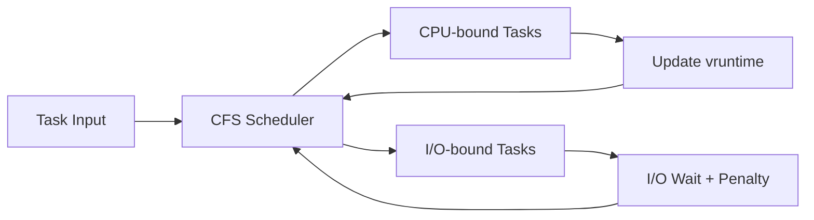
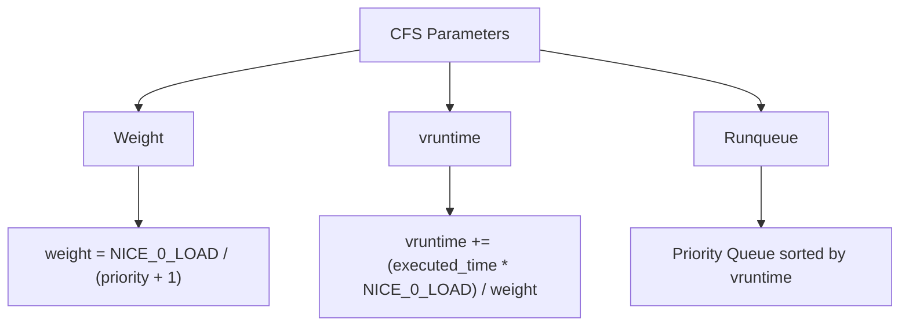
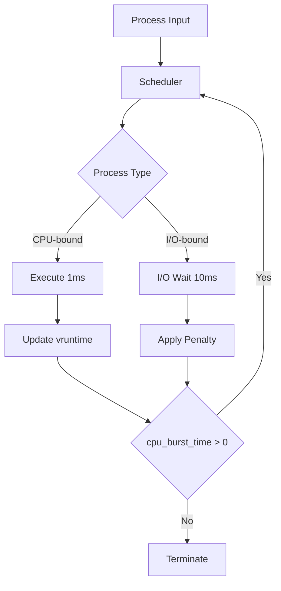
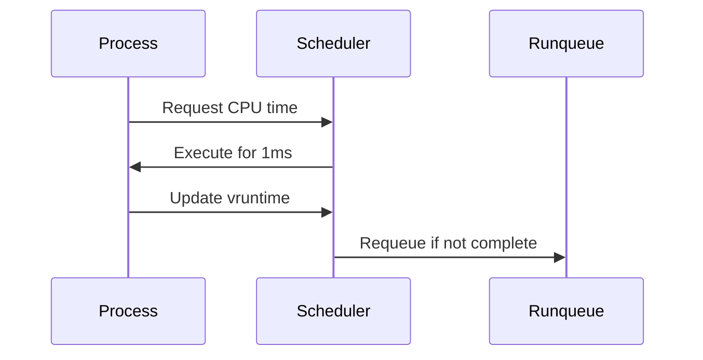
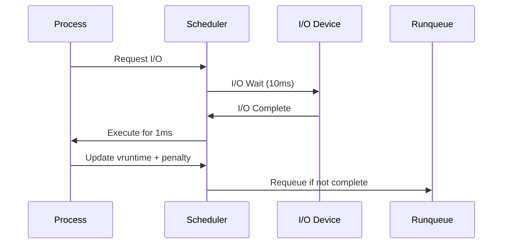

# CFS Scheduler Simulation

This project is a simulation of the **Completely Fair Scheduler (CFS)**, a process scheduling algorithm used in the Linux kernel. The simulation demonstrates how CFS manages CPU-bound and I/O-bound tasks by maintaining fairness and prioritizing tasks based on their `vruntime` and `weight`.

---

## Table of Contents
1. [Overview](#overview)
2. [Key Concepts](#key-concepts)
3. [Architecture](#architecture)
4. [Implementation Details](#implementation-details)
5. [Getting Started](#getting-started)
6. [Results](#results)
7. [References](#references)

## Overview



The **Completely Fair Scheduler (CFS)** provides fair CPU time distribution using virtual runtime (`vruntime`) metrics. Tasks with lower `vruntime` get priority, ensuring fair resource allocation.

## Key Concepts

### CFS Parameters


- **Weight**: Higher weight = Higher priority
  - `NICE_0_LOAD = 1024` (constant)
- **vruntime**: Virtual runtime metric
- **Runqueue**: Min-heap priority queue

## Architecture



## Implementation Details

### CPU-Bound Task Flow


### I/O-Bound Task Flow


## Getting Started

### Prerequisites
- C++ compiler (g++)
- Python 3.x with venv
- CMake
- Basic understanding of process scheduling

### Installation & Running
```bash
# Clone repository
git clone <repo-url>
cd cfs-scheduler-cpp

# Setup Python environment
python -m venv myvenv
source myvenv/bin/activate

# Build project
mkdir build && cd build
cmake ..
make

# Run simulation
./cfs-schedular
cd ..
python3 plot.py
```

## Results

### Process Scheduling Comparison

#### I/O-Bound Processes
- All processes have different vruntime and priorities
- I/O wait penalties affect scheduling frequency
- Higher priority tasks face larger penalties


#### CPU-Bound Processes
- Process 1 (highest priority) completes fastest
- Lower vruntime + higher priority = more frequent scheduling
- No I/O wait penalties


## References

1. [Linux CFS Documentation](https://www.kernel.org/doc/html/latest/scheduler/sched-design-CFS.html)
2. [Detailed Implementation Blog](https://singhdevhub.bearblog.dev/dissecting-linux-schedulers-implementing-our-toy-cfs_scheduler-simulation/)

---

For more details about the implementation, check out the source code in the repository.


